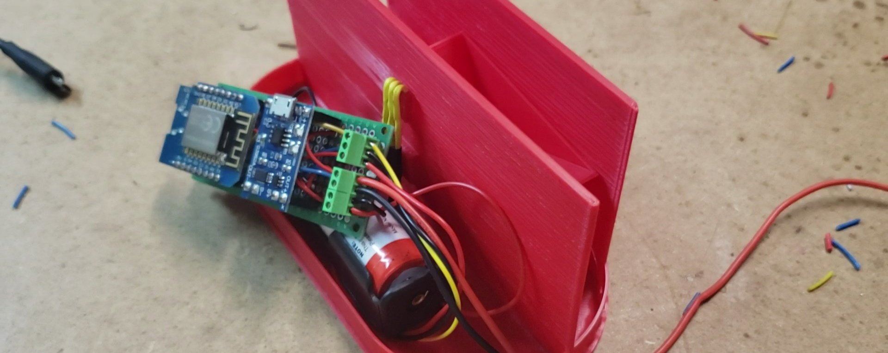

## Links
||Desc|Link|
|---|---|---|
|**Documentation**|Published docs and Discuss|[https://www.mcgurkin.net/posts/rain-gauge](https://www.mcgurkin.net/posts/rain-gauge)|
|**YouTube**|Short video of tipper working|[https://youtu.be/XX34wHzLibE](https://youtu.be/XX34wHzLibE)|
|**Rain History**|Sensor output charts|[https://www.mcgurkin.net/apps/rain](https://www.mcgurkin.net/apps/rain)|
|**BOM**|List of parts required for full build|[https://github.com/tallman5/rain-gauge/blob/main/rain-gauge-bom.md](https://github.com/tallman5/rain-gauge/blob/main/rain-gauge-bom.md)|
|**Fusion Model**|The STLs in GitHub are the "production" version. The Fusion model may have changes which have not been tested.|[https://a360.co/3bst4iC](https://a360.co/3bst4iC)|

