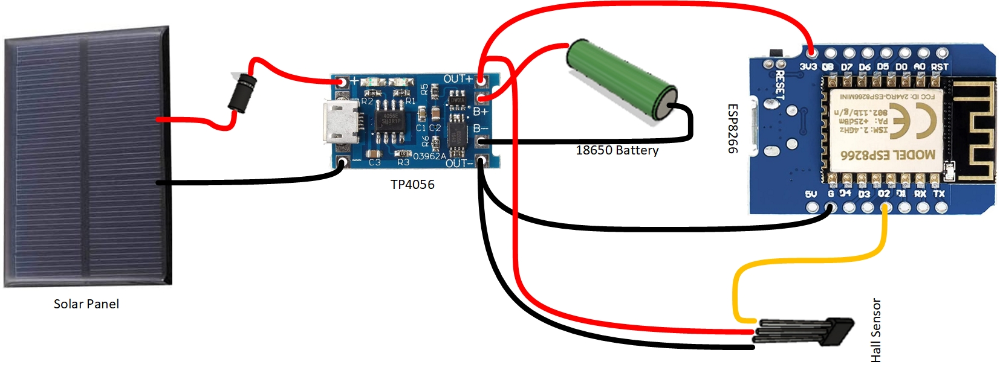
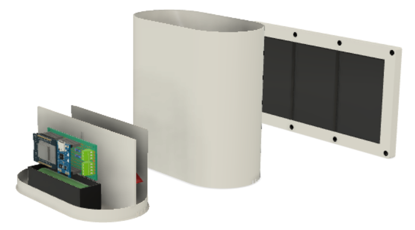

**Note:** This is still a draft

## Overview
Weather geek? Maker? These are fun. A tipping bucket rain gauge funnels 
rain into a cup which tips and empties repeatedly during a rain storm. Each "tip" correlates to a 
specific amount of rain. Count the tips, you'll know how much rain has fallen.


[](http://www.youtube.com/watch?v=XX34wHzLibE)


## Links
||Desc|Link|
|---|---|---|
|**Disucssion**|Published docs and Discuss|[https://www.mcgurkin.net/posts/rain-gauge](https://www.mcgurkin.net/posts/rain-gauge)|
|**Rain History**|Sensor output charts|[https://www.mcgurkin.net/apps/rain](https://www.mcgurkin.net/apps/rain)|
|**GitHub**|STLs, source code for the ESP8266, etc.|[https://github.com/tallman5/rain-gauge](https://github.com/tallman5/rain-gauge)|
|**BOM**|List of parts required for full build|[https://github.com/tallman5/rain-gauge/blob/main/rain-gauge-bom.md](https://github.com/tallman5/rain-gauge/blob/main/rain-gauge-bom.md)|
|**Fusion Model**|The STLs in GitHub are the "production" version. The Fusion model may have changes which have not been tested.|[https://a360.co/3bst4iC](https://a360.co/3bst4iC)|

## The Build

### Electronics


### Printed Parts



## ESP8266 Code
```c++ {numberLines}
#include <NTPClient.h>
#include <ESP8266WiFi.h>
#include <ESP8266mDNS.h>
#include <WiFiUdp.h>
#include <ArduinoOTA.h>
#include <ESP8266HTTPClient.h>
#include <Arduino_JSON.h>
#include <list>
#include "arduino_secrets.h"

#define INTERRUPT_PIN D2
#define VOLTAGE_PIN A0

// Without arduino_secrets.h
#ifndef STASSID
#define STASSID "your-ssid"
#define STAPSK "your-ssid-password"
#define HOST_NAME "esp8266-01"
#define TENANT_ID "tenant-id-guid"
#define CLIENT_ID "client-id-guid"
#define CLIENT_SECRET "client-secret"
#define SCOPE "api://ususally-client-id-guid/.default"
#define BASE_API_URL "https://some-api.azurewebsites.net"
#endif

const char* hostName = HOST_NAME;
const char* ssid = STASSID;
const char* password = STAPSK;
String tenantId = TENANT_ID;
String clientId = CLIENT_ID;
String clientSecret = CLIENT_SECRET;
String scope = SCOPE;
String baseApiUrl = BASE_API_URL;

String tokenUrl = "https://login.microsoftonline.com/" + tenantId + "/oauth2/v2.0/token";
String tokenBody = "grant_type=client_credentials&client_id=" + clientId + "&client_secret=" + clientSecret + "&scope=" + scope;
String pulseUrl = baseApiUrl + "/kpis/" + hostName + "/pulse";
String dataUrl = baseApiUrl + "/kpis/" + hostName + "/epochs";
String voltageUrl = baseApiUrl + "/kpis/" + hostName + "/voltage";

String accessToken = "";
float voltCalibration = 0.28;

// Using epochs here and conversions in API, just for simplicity
std::list<long> epochs;

// Main loop delay is 60 seconds, every 60 secoonds upload tip data
// Each loop increments counter. Bearer tokens have a default expiration of 60 minutes.
// When count hits 45 (every 45 minutes) refresh bearer token and send voltage data
int counter = 0;

WiFiUDP ntpUDP;
NTPClient timeClient(ntpUDP);

void turnOffWifi() {
  Serial.print("Disconnecting WiFi..");
  WiFi.mode(WIFI_OFF);
  while ( WiFi.status() == WL_CONNECTED ) {
    Serial.print(".");
    delay(1000);
  }
  Serial.println("done");
}

void turnOnWifi() {
  Serial.print("Connecting to WiFi...");
  WiFi.mode(WIFI_STA);
  WiFi.begin(ssid, password);
  while ( WiFi.status() != WL_CONNECTED ) {
    delay(1000);
    Serial.print ( "." );
  }
  Serial.println("done");
}

void refreshAccessToken() {
  Serial.print("Getting access token...");
  std::unique_ptr<BearSSL::WiFiClientSecure>client(new BearSSL::WiFiClientSecure);
  client->setInsecure();
  HTTPClient https;
  String authJson = "";

  https.begin(*client, tokenUrl);
  while (authJson == "") {
    int httpCode = https.POST(tokenBody);
    if (httpCode == HTTP_CODE_OK) {
      authJson = https.getString();
      JSONVar authResponse = JSON.parse(authJson);
      accessToken = (const char*) authResponse["access_token"];
      Serial.println("done");
    } else {
      Serial.println("error!");
    }
  }
  https.end();
}

void uploadData() {
  if (epochs.size() > 0) {
    Serial.print("Uploading data...");
    String body = "epochs=";
    for (auto elem : epochs) {
      body = body + (String)elem + " ";
    }
    std::unique_ptr<BearSSL::WiFiClientSecure>client(new BearSSL::WiFiClientSecure);
    client->setInsecure();
    HTTPClient https;
    https.begin(*client, dataUrl);
    https.addHeader("Content-Type", "application/x-www-form-urlencoded");
    https.addHeader("Authorization", "Bearer " + accessToken);
    int httpCode = https.POST(body);
    if (httpCode == HTTP_CODE_OK) {
      Serial.println("done");
      epochs.clear();
    } else {
      Serial.println("error!");
    }
    https.end();
  } else {
    //    Serial.println("No data to upload");
  }
}

void sendVoltage() {
  // For ESP8266 from https://amzn.to/3RfLW3z, A0 is
  // 0 to 1024 for volts of 0 to 3.3
  // Voltage divider created with two 100k resistors
  int sensorValue = analogRead(VOLTAGE_PIN);
  float voltage = 0;
  int battPercent = 0;

  if (sensorValue > 0) {
    voltage = ((sensorValue * (3.3 / 1024.0)) * 2) + voltCalibration;
    battPercent = (voltage - 2.5) * 100 / (4.2 - 2.5);
  }

  Serial.print("Sending sensor/volt/batt%: " + String(sensorValue) + "/" + String(voltage) + "/" + String(battPercent) + "...");
  String voltBody = "{ \"epoch\": " + String(timeClient.getEpochTime()) + ", \"value\": " + String(voltage) + ", \"batt\": " + String(battPercent) + " }";
  std::unique_ptr<BearSSL::WiFiClientSecure>client(new BearSSL::WiFiClientSecure);
  client->setInsecure();
  HTTPClient voltHttps;
  voltHttps.begin(*client, voltageUrl);
  voltHttps.addHeader("Content-Type", "application/json");
  voltHttps.addHeader("Authorization", "Bearer " + accessToken);
  int httpCode = voltHttps.POST(voltBody);
  if (httpCode == HTTP_CODE_OK) {
    Serial.println("done");
  } else {
    Serial.println("error!");
  }
  voltHttps.end();
}

ICACHE_RAM_ATTR void hallChanged()
{
  const int currentRead = digitalRead(INTERRUPT_PIN);
  if (currentRead == 0) {
    epochs.push_back(timeClient.getEpochTime());
    digitalWrite(LED_BUILTIN, LOW);
  } else {
    digitalWrite(LED_BUILTIN, HIGH);
  }
}

void setup() {
  Serial.begin(115200);
  delay(1000);

  ArduinoOTA.setHostname(hostName);

  pinMode(INTERRUPT_PIN, INPUT_PULLUP);
  attachInterrupt(digitalPinToInterrupt(INTERRUPT_PIN), hallChanged, CHANGE);

  pinMode(LED_BUILTIN, OUTPUT);
  digitalWrite(LED_BUILTIN, HIGH);

  turnOnWifi();

  // Initialize clock
  Serial.print ( "Updating clock." );
  timeClient.begin();
  int currentEpoch = 0;
  timeClient.update();
  while (currentEpoch < 100) {
    delay(1000);
    Serial.print ( "." );
    currentEpoch = timeClient.getEpochTime();
  }
  Serial.println("done");
  Serial.println("Epoch: " + String(currentEpoch));
}

void loop() {

  if (counter == 0) {
    refreshAccessToken();
    sendVoltage();
  }

  uploadData();

  counter++;
  if (counter >= 45) {
    counter = 0;
  }

  delay(60000);
}
```