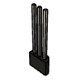
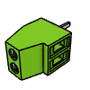
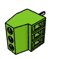
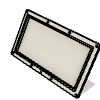
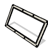
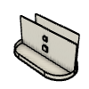
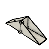
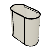
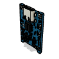

# Rain Gauge BOM

|Image|Number|Quantity|Description|
|-|-|-|-|
||18650 Battery|1|https://amzn.to/3APuPyO|
||18650 Holder|1|https://amzn.to/3TGcAo7|
||2.54 Header 1 Pin Male|2|https://amzn.to/3KK6nDy|
||2.54 Header 2 Pin Male|2|https://amzn.to/3KK6nDy|
||2.54 Header 8 Pin Female|4|https://amzn.to/3CS7b7p|
||2.54 Header 8 Pin Male|2|https://amzn.to/3CS7b7p|
||5v Solar Panel|3|https://amzn.to/3wUnVHu|
||Hall Sensor AH3364Q|1|https://amzn.to/3qakI2M|
||Schottky Diode 1N5817|3|https://amzn.to/3CWOjnV|
||ESP8266 12F|1|https://amzn.to/3CS7b7p|
||KF128-2.54-2P|2|https://amzn.to/3KK6nDy|
||KF128-2.54-3P|1|https://amzn.to/3KK6nDy|
||M3x5x4 Threaded Insert|8|https://amzn.to/3AGMAjQ|
||M3x6 SHCS|8|https://amzn.to/3QjYiGJ|
||M6x3 Magnet|1|https://amzn.to/3RhCIUT|
||panel-holder-bottom|1|3D Printed Part|
||panel-holder-top|1|3D Printed Part|
||Prototype Board 24x10|1|https://amzn.to/3KK6nDy|
||rain-gauge-base|1|3D Printed Part|
||rain-gauge-cup|1|3D Printed Part|
||rain-gauge-top|1|3D Printed Part|
||Resistor - 100K|2|https://amzn.to/3AP3Za0|
||TP4056|1|https://amzn.to/3e9tIST|